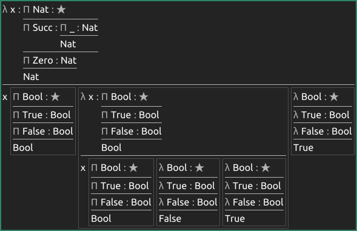

# Godsmen Foundry

Godsmen Foundry is a Morte IDE based on Source.

Implementation status:

* [x] rendering expressions
* [x] basic navigation
* [x] editing expressions
* [ ] interactive evaluation
* [ ] auto-completion
* [ ] local storage
* [ ] browsing Sigil



## Getting Started

```
$ nix build
$ result/bin/morte-to-sdam "./examples/expr.morte" > expr.sd
$ result/bin/sdam-to-svg --morte expr.sd
$ result/bin/foundry expr.sd
```

## Tooling

```
$ nix develop -c $SHELL
$ make tags
$ make fmt
```

## SVG Optimization

```
$ nix shell nixpkgs#nodePackages.svgo
$ svgo expr.svg
```
